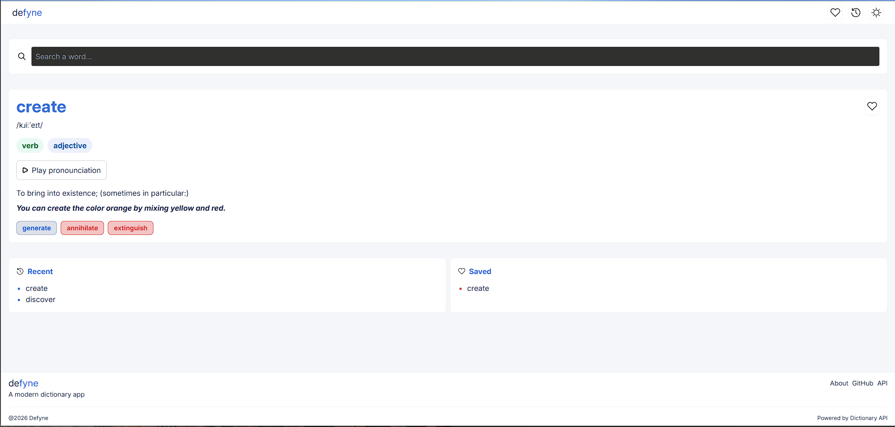
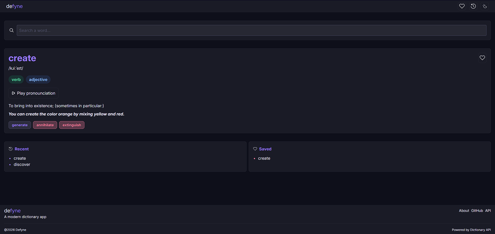
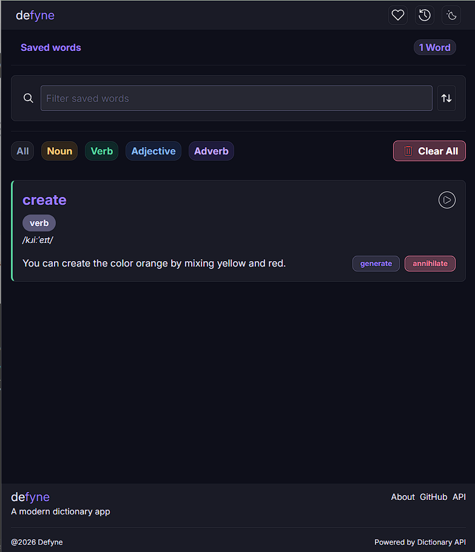
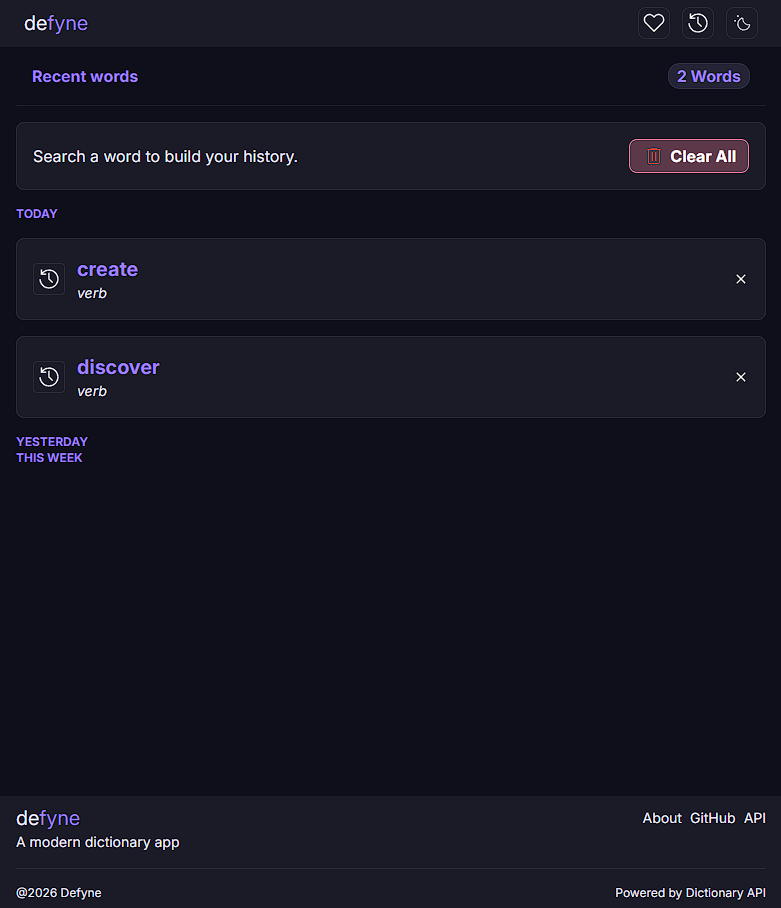

# Defyne

A modern dictionary web application built with React, Tailwind CSS, Firebase, and the Free Dictionary API. Users can search for word definitions, listen to pronunciations, save favorite words, see recent words with a searchable history that persists across sessions.

## Live Demo

🔗 Live Site:

## Screenshots

### Home


Search for any English word to view its pronunciation, definitions, examples, synonyms, and antonyms.
---
### Dark Mode

A clean dark theme for comfortable reading.
---
### Saved Words

Save words to revisit later and filter them by part of speech.
---
### Recent Searches

Quickly access words you've searched recently.

## Features

- Search for English words
- View definitions, pronunciation, and examples
- Listen to pronunciation audio
- Save favorite words
- Search and filter saved words
- View recent searches grouped by date
- Store user data using Firebase Firestore
- Anonymous Firebase Authentication
- Dark mode
- Responsive design for desktop and mobile

## Built With

- React
- Vite
- Tailwind CSS
- Firebase Authentication
- Cloud Firestore
- Free Dictionary API

## What I Learned

Building Defyne helped strengthen my understanding of:

- React state management
- Component composition
- useEffect and asynchronous data fetching
- Working with REST APIs
- Firebase Authentication
- Firestore database operations
- Conditional rendering
- Filtering and sorting application data

## Installation

Clone the repository:

```bash
git clone <repository-url>
```

Install dependencies:

```bash
npm install
```

Start the development server:

```bash
npm run dev
```

## Author

Nehemiah Brown
